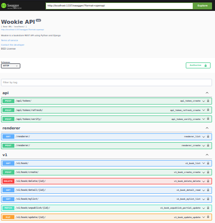

### Objective

A bookstore REST API using Python and Django.
Technologies: Python, Django, Nginx, Gunicorn and redis

### Brief

Lohgarra, a Wookie from Kashyyyk, has a great idea. She wants to build a marketplace that allows her and her friends to
self-publish their adventures and sell them online to other Wookies. The profits would then be collected and donated to purchase medical supplies for an impoverished Ewok settlement.

### A Brief APIs Description

-   A REST API returning JSON or XML based on the `Content-Type` header ([renderer](http://localhost:8000/renderer/))
-   An Author model (custom user model) with a "author pseudonym" field
-   An Implemented book model that each book have a title, description, author (custom user model), cover image and price
-   An endpoint to authenticate with the API using username, password and return a JWT access and refresh token. ([JWT](http://localhost:8000/api/token/))
    - note: for access to authorize needed Book APIs on swagger ,get `access` token from 'api/token/' and set it in value of Authorize like: Bearer `access` 
-   A searchable endpoint to get list of book resource with query paramaters. ([book-list](http://localhost:8000/v1/book/))
-   CRUD operations and an endpoint to unpublish on book resources for the authenticated user such as bellow:
    - /v1/book/mylist/ - To watch own authenticated user books. ([book-mylist](http://localhost:8000/v1/book/mylist/))
    - /v1/book/detail/`BookId`/ - To get details of a book. ([book-detail](http://localhost:8000/v1/book/detail/BookID))
    - /v1/book/create/ - To create a book for authenticated user. ([book-create](http://localhost:8000/v1/book/create/))
    - /v1/book/update/`BookId`/ - To update specific book by id. ([book-update](http://localhost:8000/v1/book/update/BookID/))
    - /v1/book/delete/`BookId`/ - To delete a book by id. ([book-delete](http://localhost:8000/v1/book/delete/BookID/))
    - /v1/book/unpublish/`BookId`/ - To unpublish a book by id. ([book-unpublish](http://localhost:8000/v1/book/unpublish/BookID/))
    
#### Note: to see a complete document of APIs refer to [Swagger](http://localhost:8000/swagger/) something like bellow


## Setup
### Development

Uses the default Django development server.

1. Rename *.env.dev-sample* to *.env.dev*.
1. Update the environment variables in the *docker-compose.yml* and *.env.dev* files.
1. Build the images and run the containers:

    ```sh
    $ docker-compose up -d --build
    $ docker-compose exec web python manage.py collectstatic --no-input --clear
    $ docker-compose exec web python manage.py createsuperuser
    ```

    Test it out at [http://localhost:8000](http://localhost:8000). The "wookie" folder is mounted into the container and your code changes apply automatically.
### Production

Uses gunicorn + nginx.

1. Rename *.env.prod-sample* to *.env.prod* and *.env.prod.db-sample* to *.env.prod.db*. Update the environment variables.
1. Build the images and run the containers:

    ```sh
    $ docker-compose down -v
    $ docker-compose -f docker-compose.prod.yml up -d --build
    $ docker-compose -f docker-compose.prod.yml exec web python manage.py migrate --noinput
    $ docker-compose -f docker-compose.prod.yml exec web python manage.py collectstatic --no-input --clear
    ```

    Test it out at [http://localhost:1337](http://localhost:1337). No mounted folders. To apply changes, the image must be re-built.

Run Tests:
```sh
    $ docker-compose up -d --build
    $ docker-compose exec web pip install -r requirements-dev.txt
    $ docker-compose exec web python manage.py test
```

## To Do
- Install [django-cacheops](https://pypi.org/project/django-cacheops/) to supports automatic or manual queryset caching on Redis
- Add [Logger](https://docs.djangoproject.com/en/4.1/topics/logging/) to log request and response details
- Use [Prometheus](https://prometheus.io/) metrics to watch real time status diagrams of resources (Nginx, Redis, Postgres)
- Add [Locust](https://locust.io/) tasks for performance and load testing in production 
